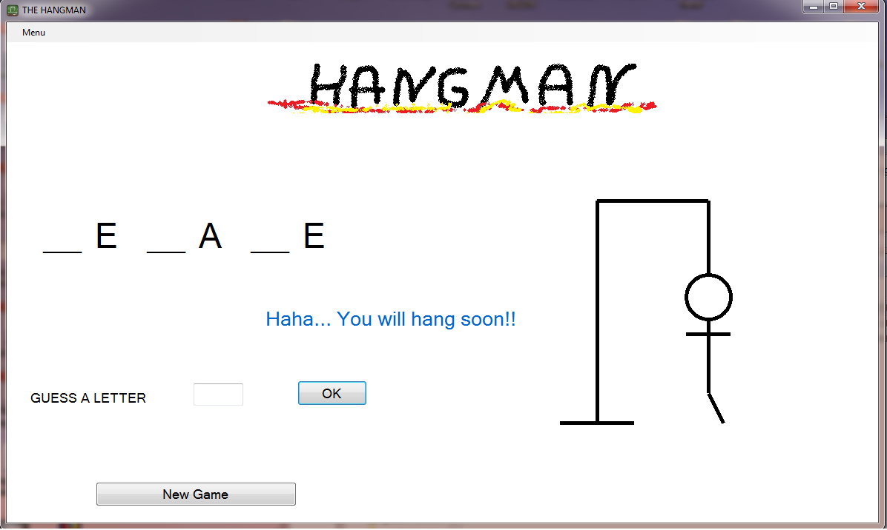

# Hangman
Hangman is a fun and popular game for everybody, no matter the age.  The task is to guess the word by guessing the letter before the picture of the hangman will be created.  User will lose if the picture will be constructed before the word is guessed. 

Code was written in VisualStudio 2017. The executable file is in bin/Release.  
  

